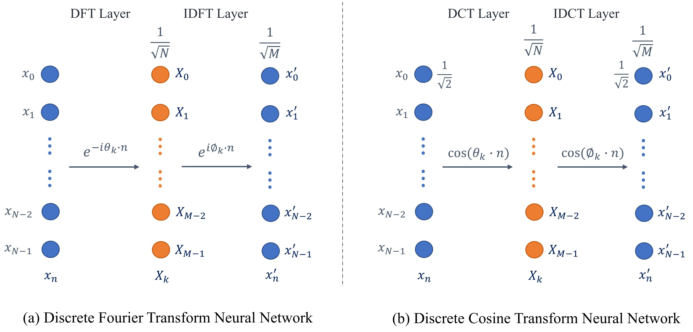
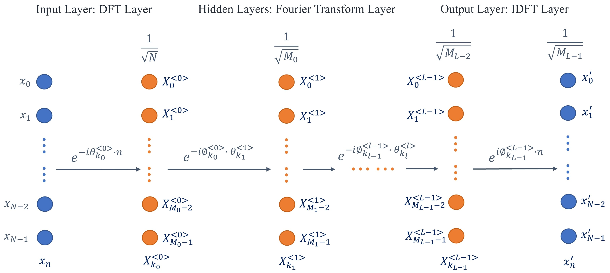
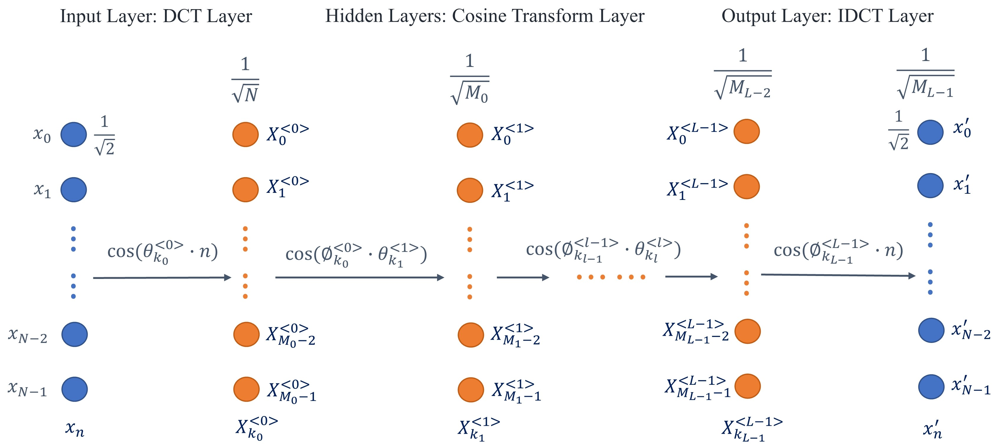

# Audio Processing Neural Networks

Here we apply the time-frequency techniques in audio processing to design a specialized neural network for audio. The first type of neural network is based on Fourier transform and involves complex number operations. The complex derivatives are computed by [Wirtinger calculus](https://pytorch.org/docs/stable/notes/autograd.html#complex-autograd-doc). To aviod the complexity of complex numbers and restrict the computations in the real domain, we further introduce the discrete cosine transform architecture into the neural network design.

<caption>
 Figure 1. Basic Structures of DFT and DCT neural networks 
</caption>

- DFT Layer

$$X_k = \tanh \big(\frac{1}{\sqrt{N}}\sum_{n=0}^{N-1} x_n \cdot e^{-i \theta_k n}\big) \qquad \text{for } k = 0,\dots,M-1$$

- IDFT Layer

$$x_n = \tanh \big(\frac{1}{\sqrt{M}}\sum_{k=0}^{M-1} X_k \cdot e^{i \phi_k n}\big) \qquad \text{for } n = 0,\dots,N-1$$

- DCT Layer

$$X_k = \tanh \Big( \frac{1}{\sqrt{N}} \big(\frac{1}{\sqrt{2}}x_0 + \sum_{n=1}^{N-1} x_n \cos [\theta_k \cdot n] \big) \Big) \qquad \text{for } k = 0,\dots,M-1$$

- IDCT Layer

$$x_0 = \tanh \Big(\frac{1}{\sqrt{2M}} \sum_{k=0}^{M-1} X_k \Big); \qquad
x_n = \tanh \Big(\frac{1}{\sqrt{M}} \sum_{k=0}^{M-1} X_k \cos [\phi_k \cdot n] \Big)\quad \text{for } n = 1,\dots,N-1$$

The training converges to the DCT (or DFT) basis:

<caption>
 Figure 2. Training Result of Angular Frequency Parameters Theta (Phi = Theta)  
</caption>

## Deep Neural Network Architecture

<caption>
 Figure 3. Deep Discrete Fourier Transform Neural Network 
</caption>

1. Input Layer: DFT Layer

$$X_{k_0}^{<0>} = \tanh \big(\frac{1}{\sqrt{N}}\sum_{n=0}^{N-1} x_n \cdot e^{-i \theta_{k_0}^{[0]} \cdot n}\big) \qquad \text{for } k_0 = 0,\dots,M_0-1$$

2. Hidden layers*: Fourier Transform Layer (stable under certain conditions)

$$X_{k_l}^{<l>} = \tanh \big(\frac{1}{\sqrt{M_{l-1}}}\sum_{k_{l-1}=0}^{M_{l-1}-1} X_{k_{l-1}}^{<l-1>} e^{-i \phi_{k_{l-1}}^{[l-1]} \cdot \theta_{k_l}^{<l>}} \big) \qquad \text{for } k_l = 0,\dots,M_l-1$$

3. Output Layer: IDFT Layer

$$x_n = \tanh \big(\frac{1}{\sqrt{M_{L-1}}}\sum_{k_{L-1}=0}^{M_{L-1}-1} X_{k_{L-1}}^{<L-1>} \cdot e^{i \phi_{k_{L-1}}^{<L-1>} \cdot n}\big) \qquad \text{for } n = 0,\dots,N-1$$

<caption>
 Figure 4. Deep Discrete Cosine Transform Neural Network 
</caption>

1. Input Layer: DCT Layer

$$X_{k_0}^{<0>} = \tanh \Big( \frac{1}{\sqrt{N}} \big(\frac{1}{\sqrt{2}}x_0 + \sum_{n=1}^{N-1} x_n \cos [\theta_{k_0}^{<0>} \cdot n] \big) \Big) \qquad \text{for } k_0 = 0,\dots,M_0-1$$

2. Hidden layers*: Cosine Transform Layer

$$X_{k_l}^{<l>} = \tanh \Big( \frac{1}{\sqrt{M_{l-1}}} \big(\sum_{k_{l-1}=0}^{M_{l-1}-1} X_{k_{l-1}}^{<l-1>} \cos[\phi_{k_{l-1}}^{<l-1>} \cdot \theta_{k_l}^{<l>}] \big) \Big) \qquad \text{for } k_l = 0,\dots,M_l-1$$

3. Output Layer: IDCT Layer

$$x_0 = \tanh \Big(\frac{1}{\sqrt{2M_{L-1}}} \sum_{k_{L-1}=0}^{M_{L-1}-1} X_{k_{L-1}}^{<L-1>} \Big); \qquad
x_n = \tanh \Big(\frac{1}{\sqrt{M_{L-1}}} \sum_{k_{L-1}=0}^{M_{L-1}-1} X_{k_{L-1}}^{<L-1>} \cos [\phi_{k_{L-1}}^{<L-1>} \cdot n] \Big)\quad \text{for } n = 1,\dots,N-1$$
